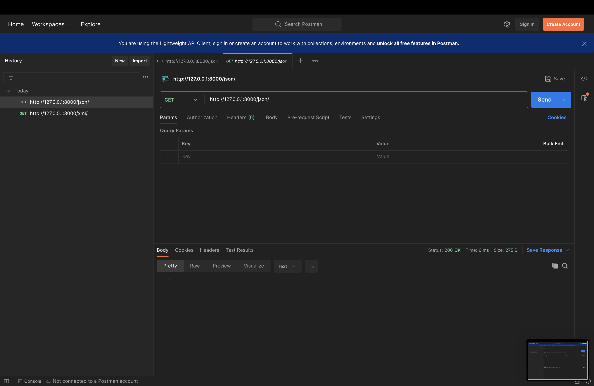
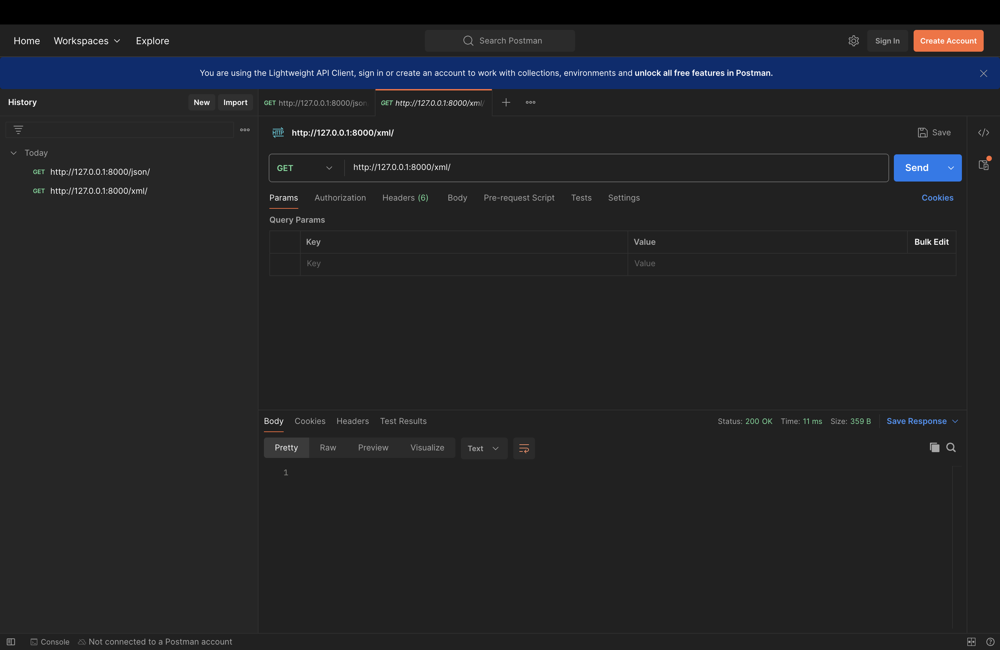

TUGAS 2

1. Jelaskan bagaimana cara kamu mengimplementasikan checklist di atas secara step-by-step (bukan hanya sekadar mengikuti tutorial).
   Saya menggunakan tutorial untuk mengimplementasikan checklist checklist dan menggunakan youtube dan slide materi MTV untuk memahami lebih dalam konsep MTV dalam django dan apa yang dilakukan oleh suatu perintah dalam django, contohnya makemigrations dan migrate.

2. Buatlah bagan yang berisi request client ke web aplikasi berbasis Django beserta responnya dan jelaskan pada bagan tersebut kaitan antara urls.py, views.py, models.py, dan berkas html.
   urls.py (urls.py akan membaca path yang direquest user semisal /login) <==> views.py (views akan membaca request dan memberi respon berupa berkas html dan juga data dari model) <==> template/berkas html, views akan memberi respon berkas html  <==> models.py (views akan merequest data, dan models akan mengakses database dan memberikan respon data yang diminta)

3. Jelaskan fungsi git dalam pengembangan perangkat lunak!
   git berguna sebagai version control system. Semisal kita sudah menyelesaikan suatu project perangkat lunak dan ingin menyimpannya, kita dapat menyimpan di git. Jika suatu saat akan ada update pada perangkat lunak tersebut, kita dapat menyimpan kembali di git. Lalu, jika ternyata update tersebut tidak jadi ingin dipakai, kita dapat memakai kembali versi pertama yang sudah disimpan di git. Kemudian, di git juga terdapat branch, dimana kita dapat membuat berbagai versi dari perangkat lunak yang kita kembangkan. Semisal, developer mengembangkan suatu aplikasi ojek online, kemudian ia ingin menambahkan fitur baru untuk taxi online, ia dapat mengembangkan fitur baru di branch lain sebelum diimplementasikan ke branch utama sehingga tidak akan mengganggu branch utama.

4. Menurut Anda, dari semua framework yang ada, mengapa framework Django dijadikan permulaan pembelajaran pengembangan perangkat lunak?
   Django memiliki fitur yang lengkap untuk mendevelop perangkat lunak, django didasarkan struktur MVT yang memungkinkan developer untuk mengerjakan masing masing tugas pada file yang terpisah sehingga nyaman untuk pemula. Selain itu, django juga menyediakan built-in admin interface yang memudahkan developer untuk mengelola data tanpa perlu melakukan coding.

5. Mengapa model pada Django disebut sebagai ORM?
   Model pada django disebut ORM (Object Relational Mapping) karena fungsinya adalah memetakan object python ke database tanpa perlu menulis SQL secara langsung. 

TUGAS 3

1. Jelaskan mengapa kita memerlukan data delivery dalam pengimplementasian sebuah platform?
    Data delivery dalam sebuah platform diperlukan untuk komunikasi antara client-side dengan server-side. Ini membuat user dapat berinteraksi dengan efektif dalam platform seperti contohnya untuk menelusuri konten, mengirim form, melakukan pembaruan secara real-time. Dalam hal ini, data yang dikirim dapat berupa data pengguna seperti foto profil, deskripsi pengguna ataupun data API external yang digunakan sebagai pertukaran data antar aplikasi. Data delivery yang efisien akan berpengaruh terhadap user experience. Data delivery yang cepat akan membuat user dapat mengakses aplikasi dengan lebih cepat.

2. Menurutmu, mana yang lebih baik antara XML dan JSON? Mengapa JSON lebih populer dibandingkan XML?
    Menurut saya, saya akan lebih memilih JSON dibandingkan XML karena JSON lebih readable dibandingkan XML. JSON berbentuk seperti sebuah HashMap/dictionary (key:value), sedangkan XML berbentuk tag html. Hal ini juga berpengaruh pada ukuran file, membuat JSON lebih kecil dalam ukuran file dibandingkan XML. Hal yang membuat JSON lebih populer dibandingkan XML seperti poin poin yang sudah saya sebutkan, ditambah lagi karena syntax JSON lebih mudah dibanding XML. (source:https://aws.amazon.com/compare/the-difference-between-json-xml/)

3. Jelaskan fungsi dari method is_valid() pada form Django dan mengapa kita membutuhkan method tersebut?
    method is_valid() berfungsi untuk memvalidasi isi dari form yang disubmit apakah sudah sesuai. Jika ada field yang belum terisi atau ada field yang tidak sesuai dengan tipe datanya, semisal data .CharField() tapi kita menginput integer, maka method is_valid() akan mereturn False. Jika data sudah valid (is_valid True) maka data akan dimasukkan ke database.

4. Mengapa kita membutuhkan csrf_token saat membuat form di Django? Apa yang dapat terjadi jika kita tidak menambahkan csrf_token pada form Django? Bagaimana hal tersebut dapat dimanfaatkan oleh penyerang?
    csrf sendiri adalah singkatan dari cross site request forgery. Artinya, request dari website yang berbeda dapat diteruskan ke request website awal. Hal ini dapat berbahaya jika ada penyerang yang membuat duplikasi website dari suatu website dan menyamar seakan akan sebagai pihak website asli dan meminta request yang berbahaya. csrf_token adalah token keamanan unik yang akan dibuat setiap kali user akan mengirimkan data dari form untuk mencegah serangan csrf. Dengan csrf token, setiap kali form disubmit akan memiliki satu token csrf yang unik, sehingga tidak akan ada form palsu.  Jika tidak ada csrf_token, selama kita masih ada di halaman website awal, dan kemudian kita mengakses website dari penyerang, form yang kita kirimkan dari website penyerang dapat diteruskan menjadi request di website awal. (source: https://www.youtube.com/watch?v=MoN2CNCjRjc)

5. Jelaskan bagaimana cara kamu mengimplementasikan checklist di atas secara step-by-step (bukan hanya sekadar mengikuti tutorial).
    Saya menggunakan tutorial untuk mengimplementasikan checklist secara garis besar, kemudian saya menggunakan youtube, chatGPT, dan website website untuk memahami kode dan konsep form pada django. 

Screenshot Postman: 

TUGAS 4

1.  Apa perbedaan antara HttpResponseRedirect() dan redirect()
    HttpResponseRedirect() hanya bisa menerima argumen berupa url, sedangkan redirect() dapat menerima model, view, atau url sebagai argumen. Keduanya sama sama melakukan hal yang sama, yaitu mengalihkan user ke url lain.
2.  Jelaskan cara kerja penghubungan model Product dengan User!
    Penghubungan model Product dengan User dilakukan dengan menggunakan ForeignKey. ForeignKey adalah suatu relasi yang memungkinkan kita menghubungkan satu ke banyak. Dimana disini satu user dapat memiliki banyak product. Setiap kali form disubmit, database akan menerima data user siapa yang mengirim form tersebut, dan user itulah yang akan dijadikan milik dari product.
3. Apa perbedaan antara authentication dan authorization, apakah yang dilakukan saat pengguna login? Jelaskan bagaimana Django mengimplementasikan kedua konsep  tersebut.
    Authentication adalah proses yang memverifikasi siapa user yang ingin mengakses website kita, apakah user ini sudah terdaftar dalam database kita. Sedangkan authorization adalah proses yang memverifikasi apakah user dapat melakukan aksi tertentu. Yang terjadi ketika user login, pertama saat user mengklik submit/login pada halaman login, data username dan password akan dicocokkan dengan yang ada di database, jika terverifikasi, user akan dialihkan ke halaman lain. Lalu, terjadi authorization, sistem akan menggunakan authorization untuk memastikan tindakan apa saja yang boleh dilakukan user, semisal apakah boleh membuat blog baru atau hanya boleh sekedar melihat lihat. Django sudah menyediakan beberapa built in views yang bisa digunakan untuk authentication dan authorization seperti login, logout, password reset. Django mengimplementasikan authentication dan authorization ketika user log in, django akan membuat session id dan cookies untuk user itu dan dari situ django akan melihat akses apa yang bisa dilakukan user (authorization).
    (source: https://www.linkedin.com/pulse/understanding-djangos-authentication-system-guide-rashid-mahmood)
4.  Bagaimana Django mengingat pengguna yang telah login? Jelaskan kegunaan lain dari cookies dan apakah semua cookies aman digunakan?
    Django mengingat pengguna yang telah login menggunakan session id kemudian django menyimpan session id dalam bentuk cookie. Setiap kali pengguna mengakses halaman itu, cookie dikirim bersama request ke server. Kegunaan lain dari cookies: authentication otomatis (Remember me), menyimpan preferensi pengguna, keranjang belanja. Tidak semua cookies aman, contoh ancamannya adalah XSS, jika sebuah website rentan terhadap XSS, penyerang dapat menyisipkan skrip berbahaya ke halaman web dan mencuri cookies pengguna. Cookies yang dicuri dapat berupa informasi sensitif pengguna yang dapat digunakan untuk mengambil akun pengguna.
5. Jelaskan bagaimana cara kamu mengimplementasikan checklist di atas secara step-by-step (bukan hanya sekadar mengikuti tutorial).
    Menggunakan ppt dari scele, internet(stackoverflow, dokumentasi django), tutorial 3